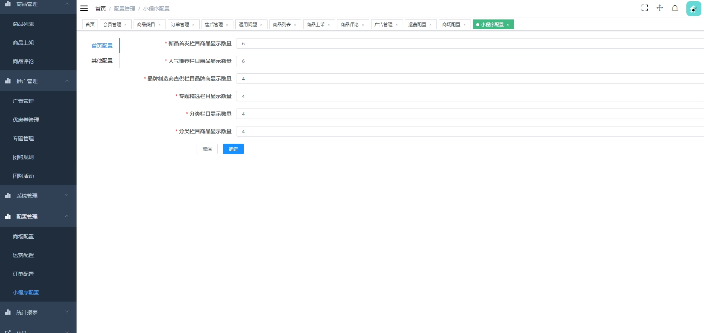

#1.项目介绍
- 功能模块：用户管理、商品管理、推广管理、系统管理、配置报表、小程序管理等
- 技术栈：SpringBoot、vue、原生微信小程序等
- 测试环境：idea2024，vscode，maven3，node12.16.1，jdk1.8，微信开发工具等
- 其实就是个商城，助农只是赋予一个特定场景，商品为农产品即可。
# 2.项目部署
## 2.1 后端部署
- 创建数据库，导入sql
- 通过idea打开项目mallsystem，根据本地数据库环境修改mall-db/src/main/resources/application-db.yml 10-13行
- 注册小程序或者注册测试小程序，配置mall-core\src\main\resources\application-core.yml 4-5行
- 启动下面几个项目
- mall-admin-api\src\main\java\org\linlinjava\litemall\admin\Application.java
- mall-all\src\main\java\org\linlinjava\litemall\Application.java
- mall-all-war\src\main\java\org\linlinjava\litemall\Application.java
- mall-wx-api\src\main\java\org\linlinjava\litemall\wx\Application.java
## 2.2 后端管理web
- 通过idea（安装了vue的插件）或者vscode等IDE打开项目 mallsystem-vue
- npm install
- npm run dev
# 2.3 小程序
- 微信开发工具打开mall-wx
- 填写appid，打开，重新编译即可。
# 3.项目部署截图

# 4.获取方式
[戳我查看](https://gitee.com/aven999/mall)